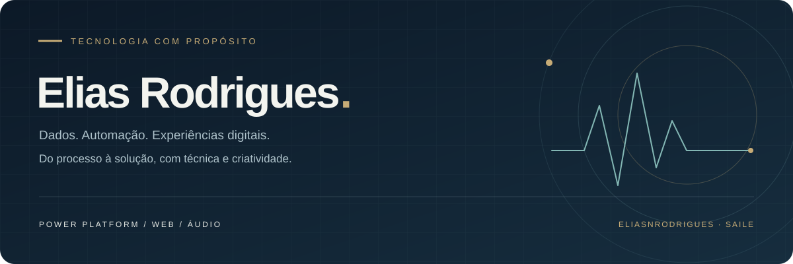

  

  <a href="https://eliasnrodrigues.github.io/contato/"><b>PORTFÓLIO & CONTATO ↗</b></a>
  &nbsp; · &nbsp;
  <a href="https://www.linkedin.com/in/elias-rodrigues-a466811a9/">LinkedIn</a>
  &nbsp; · &nbsp;
  <a href="https://www.instagram.com/eliasnrodrigues/">Instagram</a>
  &nbsp; · &nbsp;
  <a href="https://wa.me/5511976649026">WhatsApp</a>

 

### 01 / Sobre mim

**Tecnologia para resolver problemas reais.**

Sou Elias Rodrigues, também conhecido como **SAILE**. Minha experiência em logística hospitalar me aproximou de desafios de estoque, compras e acompanhamento de operações. Hoje, aplico essa visão prática no desenvolvimento de painéis, aplicativos e automações.

Trabalho com **Power BI, Power Apps e Power Automate** e desenvolvo páginas com **HTML, CSS e JavaScript**. A música também faz parte dessa trajetória: atuo com áudio ao vivo e produção musical, combinando organização técnica e criatividade.

 

### 02 / Frentes de atuação

| Dados & indicadores | Aplicativos & automação | Desenvolvimento web |
| :--- | :--- | :--- |
| Transformar informações operacionais em painéis úteis para a tomada de decisão. | Organizar solicitações e movimentações, conectando etapas de um processo. | Criar páginas responsivas para apresentar projetos e facilitar conexões. |
| **Power BI · DAX · Power Query** | **Power Apps · Power Automate · SharePoint** | **HTML · CSS · JavaScript** |

**Também utilizo:** Excel, Office Scripts, Git e GitHub.  
**Estudos e prática:** SQL e Python.

 

### 03 / Projeto em destaque

**[Contato · Página pessoal](https://github.com/eliasnrodrigues/contato)**

Portfólio de áudio, redes profissionais e WhatsApp em um único lugar. Temas claro e escuro com fotos sincronizadas, layout responsivo e seleção de serviços para direcionar o contato.

[Acessar o site ↗](https://eliasnrodrigues.github.io/contato/) &nbsp; · &nbsp; [Ver código e documentação ↗](https://github.com/eliasnrodrigues/contato)

 

### 04 / Além do código

**SAILE — áudio ao vivo & produção musical.**

Mixagem para transmissões ao vivo, edição de áudio e produção musical. Um trabalho em que escuta, precisão e colaboração caminham juntas.

[Ouça meu portfólio ↗](https://youtube.com/playlist?list=PL7TyXdBTDNoXpVn2feaHuZI7WtAUNh9y8)

 

---

  <b>Tem uma ideia ou um projeto em mente?</b> 
  Vamos conversar sobre tecnologia, processos ou música.  
  <a href="https://wa.me/5511976649026"><b>Fale comigo no WhatsApp ↗</b></a>

ELIAS RODRIGUES · TÉCNICA, CRIATIVIDADE E PROPÓSITO.

